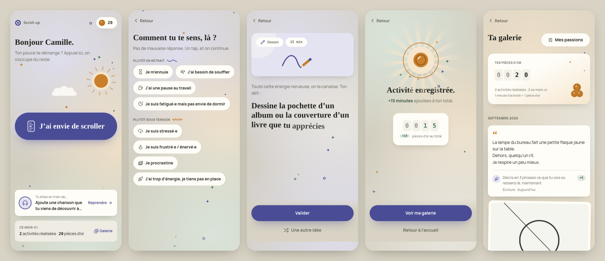

# Scroll-up — V1 test (Telegram Mini App)

*Anciennement « Plutôt Que Scroller ».*

Une app qui intercepte l'envie de scroller et propose à la place une activité créative courte, liée à une passion : dessin, écriture, musique, cinéma / animation, piano. Elle garde une trace de tout ce qui a été fait (une galerie, un compteur de minutons, un niveau par passion, des parcours de plus en plus exigeants et des projets) plutôt que de compter des jours d'abstinence. Le ton reste chaleureux, jamais punitif.

Cette V1 de test est volontairement resserrée : 5 passions (on en choisit autant qu'on veut), 75 activités (60 validées, et 15 tutos de chansons pour le piano, à relire), 3 temps (5, 15 et 30 min). Le piano inaugure le **mode progression** : une page demande son niveau, puis des leçons s'enchaînent, validées au clavier de l'appli (voir « Le mode progression » plus bas). Pas de premium, pas de paiement, pas d'IA, pas d'API externe.



> Le premier prototype web (747 activités, données dans le navigateur) est conservé dans [`prototype/`](prototype/). La pub du dossier [`promo/`](promo/) en est tirée.

---

## Organisation du dépôt

```
shared/     Types, contenus et règles partagés par l'app et le serveur
  src/activities.ts   ← les 75 activités (60 validées, recopiées telles quelles ; 15 tutos de chansons pour le piano, à relire)
  src/prompts.ts      ← ce que l'appli « tire au hasard » (mots, films, genres…)
  src/intros.ts       ← introductions selon le mood
  src/reminders.ts    ← messages de relance du bot
  src/selection.ts    ← choix d'une activité
  src/rules.ts        ← minutons, garde-fou temporel
  src/progress.ts     ← niveaux et collection par passion
  src/paths.ts        ← les 11 parcours progressifs (textes à relire)
  src/skills.ts       ← le niveau déclaré par passion (page « Ton niveau »)
  src/keyboard.ts     ← les notes, le clavier, les mélodies du piano (phrases, parties d'apprentissage)
  src/guides.ts       ← « Si tu bloques », « Une idée ? », défis en plus, objectifs d'écriture (à relire)
  src/facts.ts        ← « Le savais-tu ? » (à relire)
  src/voice.ts        ← félicitations variées, phrase d'accueil selon l'heure (à relire)
  src/monthly.ts      ← le mot du jour, thème par mois (à relire)
server/     API REST (Express) + bot Telegram (Telegraf) + base SQLite (Prisma)
app/        La Mini App (React, Vite, TypeScript, Tailwind CSS, shadcn/ui, Motion)
prototype/  Le prototype web précédent (archive)
promo/      Les pubs en motion design
```

C'est un espace de travail npm (*workspaces*) : un seul `npm install` à la racine installe tout.

---

## Tester l'application

> Pas envie d'installer quoi que ce soit ? Passe directement à [Mettre l'app en ligne](#mettre-lapp-en-ligne-sans-rien-installer) : tout se fait dans le navigateur, et tu testes ensuite depuis Telegram.

Prérequis : [Node.js](https://nodejs.org) **22.13 ou plus récent** (la version LTS actuelle convient) et [Git](https://git-scm.com).

### 1. Récupérer le code

```bash
git clone https://github.com/kenzobecker565-lab/Envie-de-scroll.git
cd Envie-de-scroll
git checkout claude/charming-curie-pg6vs5   # tant que la V1 n'est pas fusionnée
npm install
```

### 2. Dans le navigateur (le plus rapide, sans Telegram)

```bash
npm run dev
```

Ouvre http://localhost:5173. Le serveur (port 3000) et l'app (port 5173) démarrent ensemble, et la base de données se crée toute seule dans `server/data/`.

Sans token de bot, le serveur accepte une **identité de test** : l'app marche dans un navigateur normal, comme si elle était ouverte depuis Telegram.

- **Voir l'app au format téléphone** : dans Chrome, touche F12, puis l'icône « téléphone » (mode appareil).
- **Sur ton téléphone** (même Wi-Fi que l'ordinateur) : ouvre l'adresse « Network » affichée dans le terminal (du type `http://192.168.1.12:5173`).
- **Jouer un autre utilisateur** : ajoute `?dev_user=2` à l'adresse (ou 3, 4…). Chaque numéro a son propre profil et sa propre galerie.
- **Tout remettre à zéro** : arrête le serveur (Ctrl+C), supprime le dossier `server/data/`, relance `npm run dev`.
- **Musique et Cinéma** : « Valider » attend vraiment la fin de la durée choisie. **Piano** : joue le morceau sur le clavier de l'appli, « Valider » s'active à la dernière note. Pour tester vite, choisis 5 min.

Hors de Telegram, l'app affiche ses propres boutons (« Retour », boutons du bas) à la place des boutons natifs. Les vibrations ne se déclenchent que dans Telegram.

### 3. Dans Telegram (le vrai test)

1. **Crée le bot** : dans Telegram, écris à [@BotFather](https://t.me/BotFather), envoie `/newbot`, donne-lui le nom `Scroll-up` et un identifiant qui finit par `bot` (par exemple `scrollup_app_bot`). Garde le **token** qu'il te donne.
2. **Donne une adresse HTTPS à ton ordinateur.** Telegram n'ouvre les Mini Apps qu'en HTTPS. Le plus simple : [cloudflared](https://developers.cloudflare.com/cloudflare-one/connections/connect-networks/downloads/), gratuit et sans compte. Dans un **deuxième terminal** :

   ```bash
   cloudflared tunnel --url http://localhost:5173
   ```

   Il affiche une adresse du type `https://quelque-chose.trycloudflare.com`. Laisse ce terminal ouvert.
3. **Configure le serveur** : copie `server/.env.example` en `server/.env`, puis remplis :

   ```bash
   BOT_TOKEN=le-token-de-botfather
   WEBAPP_URL=https://quelque-chose.trycloudflare.com
   ```

   Toutes les variables sont commentées dans le fichier. Avec un token, l'identité de test du navigateur est coupée : ajoute `DEV_AUTH=true` pour continuer à tester aussi dans le navigateur.
4. **Relance** `npm run dev` (Ctrl+C puis `npm run dev`).
5. **Sur ton téléphone**, ouvre la conversation avec ton bot et envoie `/start` : il répond avec le bouton « Ouvrir Scroll-up ». Le bouton « Ouvrir », à gauche du champ de saisie, lance aussi l'app.

À savoir :

- L'adresse `trycloudflare.com` change à chaque lancement de cloudflared. Mets alors à jour `WEBAPP_URL` et relance `npm run dev`.
- **Photos** : sans réglage, les photos envoyées depuis l'app sont gardées sur ton ordinateur (`server/data/photos/`). Pour les ranger dans Telegram comme prévu, crée un groupe privé, ajoutes-y le bot, puis mets son identifiant dans `STORAGE_CHAT_ID` (il commence par `-100…` ; pour le trouver, envoie un message dans le groupe puis ouvre `https://api.telegram.org/bot<TOKEN>/getUpdates`).
- **Relances** : elles partent juste avant le moment de scroll choisi (7 h 30, 12 h, 18 h 30 ou 21 h 45, heure de chacun), ou vers 19 h sans moment choisi, si rien n'a été fait dans la journée. Pour en recevoir une tout de suite sans moment choisi, mets `REMINDER_HOUR` à l'heure en cours et relance le serveur.
- Facultatif : dans BotFather, `/newapp` crée un lien direct vers l'app (`t.me/<bot>/<app>`), pratique à partager avec des testeurs.

### Commandes

| Commande (à la racine) | Rôle |
| --- | --- |
| `npm run dev` | Serveur + Mini App, avec rechargement automatique |
| `npm test` | Tests automatiques (activités, règles, API, bot, relances) |
| `npm run typecheck` | Vérifie les types TypeScript |
| `npm run build` | Construit la Mini App dans `app/dist/` |
| `npm start` | Production : applique les migrations, lance le serveur, qui sert aussi la Mini App |
| `npm run db:migrate` | Après une modification de `server/prisma/schema.prisma` : crée la migration |
| `npm run db:studio` | Ouvre Prisma Studio pour explorer la base |

Sur GitHub, typage, tests et build se lancent à chaque pull request (`.github/workflows/ci.yml`).

---

## Mettre l'app en ligne (sans rien installer)

Le plus simple : [Railway](https://railway.com). Tout se fait dans le navigateur. Railway construit l'app depuis GitHub, la garde allumée (le bot doit tourner en continu) et lui donne une adresse HTTPS. Le dépôt contient déjà tout ce qu'il lui faut : le `Dockerfile` et `railway.json`.

**Prix** : l'essai offre 5 $ de crédit pendant 30 jours, largement assez pour tester. Ensuite, le plan Hobby coûte 5 $ par mois, crédit d'usage inclus ([tarifs](https://docs.railway.com/pricing/plans)).

### 1. Créer le bot

Dans Telegram, écris à [@BotFather](https://t.me/BotFather), envoie `/newbot`, appelle-le `Scroll-up` et choisis un identifiant qui finit par `bot`. Garde le **token** qu'il te donne (une ligne du type `123456789:AAH…`).

### 2. Créer le projet sur Railway

1. Va sur [railway.com](https://railway.com) et connecte-toi avec ton compte **GitHub**.
2. Ouvre [railway.com/verify](https://railway.com/verify) pour **vérifier ton compte**. Sans vérification, l'essai limite les connexions sortantes, et le bot risque de ne pas joindre Telegram.
3. **New Project**, puis **Deploy from GitHub repo**. Choisis `Envie-de-scroll`. S'il n'apparaît pas, clique sur **Configure GitHub App** et donne à Railway l'accès à ce dépôt.
4. Railway crée un service et lance tout de suite une première construction, depuis la branche principale du dépôt. **Elle peut échouer, c'est normal** : on change de branche juste après.

### 3. Régler le service

Clique sur le service (le rectangle au milieu de l'écran) pour ouvrir son panneau.

1. Onglet **Settings**, partie **Source** : choisis la branche `claude/charming-curie-pg6vs5` (tant que la V1 n'est pas fusionnée dans la branche principale).
2. Onglet **Variables**, bouton **New Variable**, ajoute :
   - `BOT_TOKEN` : le token de BotFather ;
   - `PORT` : `8080`.
3. Ajoute un **volume**, le disque qui garde la base de données entre deux mises à jour. Fais un clic droit sur le fond du projet (ou `Ctrl+K` / `⌘K`, puis tape « volume »), choisis **Volume**, sélectionne le service, puis indique le chemin de montage **`/data`**.
4. Onglet **Settings**, partie **Networking** : clique sur **Generate Domain** et indique le port `8080`. Tu obtiens une adresse du type `https://scroll-up-production.up.railway.app`.
5. **Applique tout** : Railway met les réglages en attente. Un bandeau en haut du projet indique le nombre de modifications : clique sur son bouton **Deploy**. Attention, le bouton « Redeploy » d'un ancien déploiement n'applique **pas** ces modifications.

La construction prend quelques minutes (onglet **Deployments**). Quand le déploiement est vert (**Active**) :

- ouvre `https://<ton-adresse>.up.railway.app/api/health` : la page doit afficher `{"ok":true}` ;
- dans les journaux (**View logs**), tu dois voir `[bot] Connecté : @ton_bot` puis `[bot] À l’écoute des messages`.

### En cas de souci

| Ce que tu vois | Ce qu'il faut faire |
| --- | --- |
| La construction échoue (croix rouge) sur la branche `claude/charming-curie-pg6vs5` | Copie les dernières lignes du journal de construction et envoie-les pour qu'on regarde. |
| L'adresse affiche « Application failed to respond » | Le port ne correspond pas : vérifie la variable `PORT` = `8080` et le port du domaine (Settings → Networking) = `8080`. |
| Journaux : `Telegram refuse BOT_TOKEN (401)` | Le token est mal copié : corrige la variable `BOT_TOKEN`, puis **Deploy** dans le bandeau. |
| Journaux : `Telegram injoignable` | Compte non vérifié : passe par [railway.com/verify](https://railway.com/verify), puis relance le déploiement. |
| Journaux : `WEBAPP_URL absente`, ou le bot répond sans bouton « Ouvrir Scroll-up » | Ajoute la variable `WEBAPP_URL` avec ton adresse complète (`https://…up.railway.app`), puis **Deploy**. |
| Journaux : `409: Conflict` | Le même token est utilisé ailleurs en même temps (par exemple l'app lancée sur ton ordinateur) : arrête l'autre. |
| Dans un navigateur, l'adresse affiche « Ouvre l'app depuis Telegram » | C'est normal : l'app ne fonctionne que dans Telegram. |

### 4. Tester

Sur ton téléphone, ouvre la conversation avec ton bot et envoie `/start`. Touche **« Ouvrir Scroll-up »** : c'est parti. Le bouton **Ouvrir**, à gauche du champ de saisie, lance aussi l'app.

Pour faire tester d'autres personnes, envoie-leur simplement le lien de ton bot (`t.me/ton_bot`). Dans BotFather, `/newapp` crée aussi un lien direct vers l'app (`t.me/ton_bot/app`).

**Raccourci sur l'écran d'accueil (iPhone)** : déclare l'app comme « app principale » du bot. Dans BotFather : `/mybots`, ton bot, **Bot Settings**, **Configure Mini App**, **Enable Mini App**, puis l'adresse publique de l'app (celle de Railway). Sur iPhone, l'icône créée depuis les réglages de l'app ouvre `t.me/ton_bot?startapp`, qui lance cette app principale ; sans elle, l'icône n'ouvre que la conversation. Sur Android, l'icône ouvre l'app du bouton **Ouvrir**, avec ou sans ce réglage. Si le téléphone ne demande rien après « Ajouter » (fréquent chez Xiaomi, Huawei, Oppo…), il faut autoriser Telegram à créer des raccourcis : Paramètres du téléphone, Applications, Telegram, Autorisations, « Raccourcis sur l'écran d'accueil ». L'app le dit elle-même au bout de quelques secondes.

### À savoir

- **Mises à jour** : chaque nouveau commit sur la branche redéploie l'app tout seul. Pendant quelques secondes, l'app est indisponible : Railway arrête l'ancienne version avant de lancer la nouvelle, pour protéger la base de données.
- **Photos** : sans réglage, elles sont gardées sur le volume. Pour les ranger dans Telegram comme prévu, crée un groupe privé, ajoutes-y le bot, puis ajoute la variable `STORAGE_CHAT_ID` avec l'identifiant du groupe (voir plus haut).
- **Adresse** : l'app utilise automatiquement le domaine Railway. Avec un nom de domaine à toi, ajoute la variable `WEBAPP_URL` (ex. `https://app.scroll-up.fr`).
- **Autres hébergeurs** : le `Dockerfile` marche partout (Fly.io, Render, un VPS…). Il faut un disque persistant monté sur `/data`, la variable `BOT_TOKEN`, et `WEBAPP_URL` avec l'adresse publique. Sans Docker : `npm ci`, `npm run build`, puis `npm start` avec `NODE_ENV=production` et `DATABASE_URL=file:/chemin/vers/scroll-up.db`.
- **Webhook** : par défaut, le bot va chercher ses messages chez Telegram (*long polling*), rien à configurer. `BOT_MODE=webhook` le fait passer en webhook, sur `https://<ton-domaine>/telegram/webhook`.

> Pour passer plus tard à Postgres (Neon, Supabase…), il suffit de changer le `provider` dans `server/prisma/schema.prisma`, l'adaptateur dans `server/src/db.ts`, et de régénérer les migrations.

---

## Le parcours

1. **Onboarding** : une bienvenue courte (illustration unDraw), le choix des passions sur des cartes illustrées (autant qu'on veut, au moins une), **« Ton niveau au piano ? »** si le piano en fait partie (voir « Le mode progression »), puis « Tu scrolles surtout quand ? » (le matin, le midi, le soir, la nuit) : le bot enverra sa relance juste avant ce moment-là. « Pas de message, merci » coupe les relances.
2. **Trois onglets**, dans une barre en bas : **Créer** (l'accueil), **Progresser** (minutons, palier, mot du jour, parcours, passions, badges) et **Galerie** (projets et créations). La barre disparaît pendant une activité ; le bouton retour de Telegram ramène à Créer.
    - **Créer** : « Bonjour Camille. » (ou « Bonsoir »), et Minuton, la mascotte, qui dit une phrase selon l'heure (« Encore debout ? Tire vers le haut, on fait calme. »). Puis **une seule carte**, la plus utile maintenant : « Tu étais en train de… » si une activité attend d'être validée, sinon le mode d'emploi (première fois), le mot du jour (pas encore fait), le parcours en cours, ou le mois. Tout le bas de l'écran est **la tirette** « J'ai envie de scroller » : on la tire vers le haut, comme on scrolle, mais pour créer (vibration quand elle est assez haut, « Lâche : on s'occupe de toi »), elle recouvre l'écran et le parcours commence. Un simple toucher marche aussi, comme la souris sur ordinateur. Elle suit le thème : stickers des passions (Pop, Pop Nuit), trame et étoile de BD, bandes et formes géométriques (Memphis). Sur un petit téléphone, elle reste collée en bas.
    - **Progresser** : les minutons en grand et la jauge du prochain palier, le mot du jour, « Tes parcours » (le parcours du moment dans chaque passion), « Tes passions » (niveau et collection, avec leur détail) et la vitrine des badges.
    - **Galerie** : le nombre de créations, les projets, puis les créations.
3. **Déclenchement** : « On a reçu ton signal de détresse pré-scroll. On s'occupe de toi. », puis enchaînement automatique (un toucher pour aller plus vite).
4. **Mood** : 8 moods en deux familles, un tap.
5. **Temps** : 5, 15 ou 30 min.
6. **Passion du moment** : seulement si le profil en compte plusieurs.
7. **Activité** : une carte qui se retourne (la scène de la passion en haut, l'activité en dessous), avec « Une autre idée », qui tire une nouvelle carte, et « Valider ». **Au piano, ce sont des tutos de chansons** (voir « Les tutos de chansons » plus bas) : le clavier et la partition sont sous la carte, et « Valider » s'active dès la dernière note jouée. Sous la carte, **« Un coup de pouce ? »** : une rangée de pastilles ; l'aide choisie s'ouvre juste en dessous, un autre toucher la referme :
    - **« Une idée »** quand l'activité demande de trouver soi-même : trois suggestions (des albums cultes, des artistes à découvrir, des films cultes, des sessions live, un style de dessin, un lieu, un personnage…), d'autres d'un tap, et pour celle qu'on choisit, les liens pour l'écouter (YouTube, Spotify, Deezer), voir la bande-annonce et où regarder le film (JustWatch), ou en voir des images. L'idée choisie pré-remplit « Qu'as-tu exploré ? ». Ce que l'appli tire au hasard (genre, film, court-métrage) a les mêmes liens.
    - **« Si tu bloques »** : Minuton donne 2 ou 3 pistes pour démarrer, pour chacune des 75 activités.
    - **« Un défi en plus »** (Dessin, Écriture) : une contrainte facultative (« sans lever le crayon », « sans aucun adjectif »…) ou une palette de 3 couleurs.
    - **« Sans papier »** (Dessin) : une feuille à dessiner dans l'app (6 couleurs, 3 épaisseurs, gomme, annuler) ; le dessin part comme une photo.
    - **« Sans son »** (Musique, Cinéma) : seulement des activités qui se font sans écouter (lire des résumés, composer une liste…). S'il n'y en a pas pour ce temps, l'app le dit.
8. **Après « Valider »** : la consigne reste collée en haut de l'écran (repliée sur trois lignes, un toucher la déplie, avec ce que l'appli a tiré : mots, film…), pour ne jamais devoir revenir en arrière ; sur l'écran de l'activité aussi, elle se colle en haut dès qu'on fait défiler les aides. Puis une photo du dessin (ou le dessin au doigt), le texte écrit, ou, pour Musique et Cinéma, le titre exploré (facultatif). Au piano, pas d'écran de preuve : le morceau joué au clavier vaut preuve, et son titre rejoint la galerie. Le texte s'écrit dans un vrai carnet (spirale, lignes, marge), avec l'objectif de l'activité quand elle en a un (« 63 / 100 mots », « 3 phrases ») ; le brouillon est gardé sur le téléphone si on quitte l'app.
9. **Confirmation** : « Activité enregistrée. +X minutons ajoutés à ton total. », avec Minuton qui fait la fête, le compteur qui roule, des confettis discrets et une vibration, et une félicitation qui change à chaque fois (« 42 mots, rien qu'à toi. »). Puis **une seule grande nouvelle**, la plus importante : l'étape de parcours réussie (« Étape 3/6 réussie ! », puis la prochaine marche) ou le badge du parcours terminé, sinon le niveau franchi dans la passion, le palier, le mot du jour, ou « Nouvelle activité dans ta collection ». Ensuite la note de l'activité. « Le savais-tu ? » (une anecdote liée à la passion) et « Ranger dans un projet » sont repliés : un toucher les ouvre.
10. **Galerie** (onglet) : les projets, puis une carte par activité, groupées par mois. Les minutons, la progression par passion et les badges sont dans l'onglet Progresser. Chaque passion a son objet : le dessin en **polaroïd** scotché, le texte sur une **page de carnet** à spirale, la musique en **vinyle** qui sort de sa pochette, le cinéma en **ticket de séance**, le piano en **page de partition** (la portée, quelques notes et le morceau joué). Jamais de calendrier. Chaque création se partage à un ami.
    - **Minutons** : la monnaie de l'app. 1 minute d'activité = 1 minuton (jeton en forme de petit chrono).
    - **Ta progression**, une carte par passion. Elle donne :
      - **le niveau**, qui monte avec les minutons gagnés dans la passion : niveau 1 à la 1re activité, puis 30 min, 2 h, 5 h et 10 h ;
      - **le titre**, de « Gribouilleur·euse » à « Virtuose du trait » en Dessin, de « Griffonneur·euse » à « Romancier·ère » en Écriture, de « Curieux·euse » à « Encyclopédie sonore » en Musique, de « Spectateur·rice » à « Cinémathèque ambulante » en Cinéma, de « Pianoteur·euse » à « Virtuose du clavier » en Piano ;
      - **la jauge** vers le niveau suivant ;
      - **la collection** : les 15 activités de la passion (5 par temps), dont celles déjà faites, à découvrir une à une.
    - **Le détail d'une passion** : on touche une carte pour voir ses parcours, sa signature, les cinq niveaux, la collection (les activités faites se dévoilent, les autres restent cachées) et le bouton « Une activité Dessin », qui lance le parcours sans repasser par le choix de la passion. La logique est dans `shared/src/progress.ts`.
    - **La signature de la passion**, ce qui montre le mieux le chemin parcouru : en Dessin, le premier et le dernier dessin côte à côte (« Avant → Maintenant ») ; en Écriture, les mots écrits (et l'équivalent en pages) et le texte le plus long ; en Musique et en Cinéma, la discothèque et la filmothèque (les titres explorés) ; en Piano, le répertoire (les morceaux joués). Pour le piano, le détail montre aussi **« Ton niveau »**, avec « Changer ».
    - **Tes projets** : on rassemble ses créations autour d'une idée (« Ma nouvelle », « Carnet de croquis », « Le tour du jazz »…), avec un objectif facultatif (5, 10 ou 20 créations). Une création se range dans un projet à la confirmation ou depuis la galerie ; « Continuer ce projet » lance une activité de la passion qui s'y range d'elle-même. La fiche du projet montre les créations, les minutes, les mots, la jauge de l'objectif et, en Dessin, le premier et le dernier dessin. « Terminer le projet » le fête (confettis, « Le partager ») ; on peut le rouvrir. Supprimer un projet ne supprime pas ses créations.
11. **Les parcours** : pour sentir sa progression, marche après marche. Deux parcours par passion, un **débutant** puis un **confirmé** (trois pour le piano, avec un **avancé**) :
    - Dessin : « Premiers traits » (badge « Œil affûté »), puis « Visages » (« Portraitiste ») ;
    - Écriture : « Premières pages » (« Première plume »), puis « Une nouvelle en six temps » (« Nouvelliste ») ;
    - Musique : « Oreille curieuse » (« Oreille fine »), puis « Voyage musical » (« Oreille du monde ») ;
    - Cinéma : « Regard curieux » (« Œil curieux »), puis « Œil de cinéaste » (« Œil de cinéaste ») ;
    - Piano : « Premières touches » (« Doigts en éveil »), puis « Mes premiers morceaux » (« Deux mains »), puis « Jouer pour de vrai » (« Pianiste »).

    Chaque parcours compte **six étapes de plus en plus exigeantes** : Échauffement et Facile (5 min), Moyen et Corsé (15 min), Difficile et Défi final (30 min). Chaque étape dit ce qu'elle fait travailler (« Tu travailles : les ombres ») et s'appuie sur la précédente. Une jauge en escalier montre la difficulté.
    - **Déblocage** : une étape s'ouvre en réussissant la précédente ; le parcours confirmé, en finissant le débutant ou au niveau 3 de la passion ; l'avancé, en finissant le confirmé. Le niveau déclaré ouvre directement les parcours de son palier (« Je connais les bases » : le confirmé ; « Je joue déjà » : tous). Une étape réussie peut se rejouer.
    - **L'écran d'un parcours** se lit comme une ascension : le départ en bas, le sommet et son badge en haut. Seule l'étape à jouer est détaillée, avec « Commencer l'étape 3 » ; les suivantes, cadenassées, montrent seulement ce qu'elles feront travailler. Parcours terminé : le badge, et le palier suivant.
    - **Une étape est une leçon, à part du reste de l'appli** (le mode progression) : « Commencer l'étape » l'ouvre tout de suite, **sans signal, sans humeur, sans choix du temps**. Même preuve (photo, texte), mêmes minutons ; il n'y a pas d'« Une autre idée ». Au piano, la leçon se valide **au clavier**, dès la dernière note, sans attendre de durée. Les étapes comptent pour les niveaux, pas pour la collection (qui reste celle des 75 activités).
    - **On enchaîne** : une étape réussie montre une fête courte (« Étape 2/6 réussie ! », les marches franchies) et **propose aussitôt l'étape d'après** (son titre, ce qu'elle fait travailler) avec un gros « Étape suivante ». Au bout d'un parcours : le badge, puis « Commencer le palier suivant ». « Revoir le parcours » ramène à l'ascension ; le retour, pendant une leçon, aussi.
12. **Le mode progression** (le piano en premier) : pour apprendre une passion pas à pas, avec du contenu à sa mesure.
    - **La page « Ton niveau »**, juste après le choix des passions (et à tout moment depuis le détail de la passion, « Ton niveau · Changer ») : trois réponses, « Je n'ai jamais joué », « Je connais les bases », « Je joue déjà », chacune avec ce qu'elle veut dire et le parcours par lequel on commencera (« Tu commences par « Premières touches » »).
    - **Le contenu ciblé** : les activités tirées au hasard sont celles du niveau (un débutant ne tombe pas sur « déchiffre un morceau », quelqu'un qui joue déjà ne refait pas « trouve tous les Do ») ; l'onglet Progresser met en avant le parcours du niveau, et ceux des paliers en dessous restent ouverts pour réviser.
    - **Trois parcours, dix-huit leçons** : « Premières touches » (le clavier, cinq doigts, cinq notes, un premier air, sans lire une note), « Mes premiers morceaux » (la main gauche, les deux mains, les accords), « Jouer pour de vrai » (gammes, arpèges, un morceau du début à la fin).
    - **Le clavier de l'appli**, dans chaque leçon et chaque tuto : il sonne au toucher, à plusieurs doigts (son de piano synthétisé, sans fichier : `app/src/lib/pianoSound.ts`), et montre juste ce qu'il faut de touches pour la partie en cours (une octave au moins, le point marque le do central). C'est un professeur patient : la touche à jouer s'allume, « Écouter » joue la partie en entier, une fausse note donne un indice (« Presque ! Cherche le Mi. ») et la fin se fête. Chaque leçon a sa mélodie (« Au clair de la lune », la gamme de Do, « Frère Jacques », des arpèges, « Lettre à Élise »…).
    - **La partition en entier sous les yeux** : toutes les notes de la partie d'un coup, une ligne par phrase (Do Do Do Ré Mi Ré…), celles jouées en vert, celle à jouer en tomate. Pour lire le morceau tranquillement, la consigne collée en haut se réduit à une ligne.
    - **Les morceaux longs en plusieurs parties** : « Partie 1 · 2 · 3 », à apprendre l'une après l'autre (« Partie 1 réussie ! → Partie 2 »), dans l'ordre qu'on veut ; le morceau est joué quand toutes les parties le sont.
    - **Les tutos de chansons**, dans « J'ai envie de scroller » : au piano, les 15 activités sont des chansons à apprendre au clavier, du plus simple au plus exigeant : « Au clair de la lune », « Frère Jacques », « Ah ! vous dirai-je, maman », le refrain de « Vive le vent », « Joyeux anniversaire » (5 min) ; l'« Ode à la joie », « When the Saints Go Marching In », la « Berceuse » de Brahms, « Au matin » de Grieg, « Une petite musique de nuit » (15 min) ; la « Lettre à Élise », le « Menuet en sol », le « Canon » de Pachelbel, la « Marche turque », « Greensleeves » (30 min). Toutes du domaine public. Le niveau déclaré choisit les chansons. « Une idée » propose d'autres chansons (« La Vie en rose », « Hallelujah », « Comptine d'un autre été »…) avec un lien vers un tuto vidéo : elles ne sont pas libres de droits, on ne peut pas les recopier note à note. Chaque morceau joué rejoint le répertoire (la signature du piano) et la galerie.
    - **Pour une autre passion** (guitare, photo, langue…) : la même mécanique sert telle quelle. Il suffit de lui donner une question de niveau (`skill` dans `passions.ts`), de dire pour quels niveaux est chaque activité (`ACTIVITY_SKILLS` dans `selection.ts`) et de lui écrire des parcours sur trois paliers.
13. **Le mot du jour** : un mot par jour, à dessiner ou à écrire en 15 minutes (Dessin, Écriture). Chaque mois a son thème : « Octobre des frissons doux » (lanterne, chat noir, brume…), « Novembre cocon », « Décembre des lumières » ; les autres mois, le mot est tiré dans la liste générale. L'écran montre le mot en grand, puis les mots passés du mois : ceux qu'on a faits se colorent, les autres se rattrapent quand on veut. Pas de jour « raté », on compte seulement ce qu'on a fait.
14. **Paliers** : 5 min, 30 min, 1 h, 2 h, 5 h, 10 h, 20 h de création. Le palier franchi est célébré à la confirmation ; l'onglet Progresser montre la jauge du prochain (« plus que 25 min »). Du temps gagné, jamais du temps manqué.
15. **Réglages** (bouton à côté des minutons, sur l'onglet Créer) : le style en grille, les passions, la musique d'ambiance, les relances du bot et le moment de scroll (Matin, Midi, Soir, Nuit), « Ajouter à l'écran d'accueil » (Telegram 8 et plus : l'icône de Scroll-up à côté des autres apps du téléphone. Une fenêtre de Telegram demande « Ajouter », puis le téléphone confirme : Telegram Android ignore toute demande qui ne suit pas un toucher sur ses propres boutons. La ligne confirme l'ajout, et dit quoi faire quand ce n'est pas possible : Telegram trop ancien, ordinateur, téléphone qui refuse), inviter un ami, donner son avis, et **« Effacer mes données »** : après une confirmation, tout ce qui concerne la personne est supprimé (créations et photos, minutons, parcours, projets, avis, suivi d'usage, réglages, et ce qui est gardé sur le téléphone) et l'app repart de l'inscription. Pratique pour refaire le parcours d'un nouveau. Le rôle d'admin est gardé. Les photos déjà relayées dans le chat de stockage Telegram y restent, mais ne sont plus reliées à personne.
16. **Musique d'ambiance**, tout doux, en fond. **Dix styles** au choix dans les réglages (« Ta musique ») : jazz noir (par défaut), lo-fi, piano, bossa nova, acoustique, synthwave, 8-bit, ambient, tropical, et la pluie pour ceux qui ne veulent pas de musique. « Au hasard » joue un style différent à chaque ouverture. Un tap sur un style le fait entendre tout de suite, avec un fondu, et remet la musique si elle était coupée.
    - **Le reste du comportement** : la musique démarre au premier toucher. On la coupe d'un geste (bouton note de musique de l'accueil, ou interrupteur des réglages). Le style et le choix on/off sont gardés sur le téléphone. Elle se retire quand l'app passe en arrière-plan, et pendant les activités Musique, Cinéma et Piano (le clavier de l'appli a la place).
    - **Le volume** passe par Web Audio, pour être réglable aussi sur iPhone (`src/lib/ambient.ts`). Tous les morceaux sont au même volume (−16 LUFS), en MP3 de 3 minutes au plus (2 Mo).
    - **Les morceaux** : le jazz noir a été généré avec vidIQ et la pluie synthétisée pour Scroll-up. Les huit autres sont de Kevin MacLeod ([incompetech.com](https://incompetech.com)), sous licence Creative Commons BY 4.0. Ils sont crédités en bas des réglages. La liste est dans `shared/src/ambiances.ts`, les fichiers sont préparés par `promo/ambiances/build.mjs`.

## Pendant le test : avis, notes et chiffres

- **Avis écrits** : « Un avis, une idée ? » sur l'accueil, « Donner mon avis » dans les réglages, ou « Un mot à ajouter ? » après une activité. Un testeur peut aussi simplement écrire au bot. Chaque avis arrive **en direct dans Telegram, chez les admins**.
- **Note de chaque activité**, juste après « Activité enregistrée. » : j'ai adoré, sympa, pas pour moi. De quoi trier les 75 activités.
- **Suivi d'usage** (sans aucun texte libre) : ouvertures, appuis sur le gros bouton, humeur, temps et passion choisis, partages, invitations, style de musique choisi, musique coupée, « Si tu bloques » ouvert, liens d'écoute ou de visionnage ouverts, défis en plus tirés, mot du jour ouvert, demandes d'ajout à l'écran d'accueil et icônes ajoutées, niveau déclaré dans une passion, leçons lancées (depuis le parcours ou enchaînées), parties de morceau réussies et morceaux joués jusqu'au bout. On voit où le parcours se perd, et quelles aides servent.
- **Devenir admin** : envoie `/admin` au bot **avant de partager le lien** : la première personne qui le fait devient admin. On peut aussi fixer la variable `ADMIN_IDS` (identifiants Telegram séparés par des virgules), qui prend alors le dessus.
- **Commandes d'admin** : `/stats` (le test en chiffres : testeurs, pianistes et leur niveau déclaré, moments de scroll choisis et relances coupées, entonnoir du parcours (dont la tirette tirée plutôt que touchée), onglets ouverts, passions, durées, humeurs, notes, styles de musique choisis, leçons lancées, étapes de parcours réussies et parcours terminés, projets créés et terminés, mots du jour faits, icônes ajoutées à l'écran d'accueil, activités les mieux et les moins bien notées), `/avis` (les derniers avis), `/export` (deux fichiers CSV à ouvrir dans Excel : activités validées, avec l'étape de parcours et le projet, et avis). Pour un testeur, `/stats` donne ses propres chiffres : minutons, paliers, niveau et collection par passion, parcours en cours, mots du jour du mois et projets.

## Les règles

- **Choix de l'activité** (`shared/src/selection.ts`) : tirage parmi les 5 activités de la passion × du temps, en écartant les 3 dernières proposées pour cette combinaison. « Une autre idée » écarte toujours l'activité affichée : en enchaînant, une activité ne revient jamais dans 4 propositions d'affilée. Le tirage penche, sans jamais rien exclure : une activité notée « J'ai adoré » revient plus souvent (×1,6), « Pas pour moi » rarement (×0,25) ; une humeur « en retrait » favorise les activités calmes, une humeur « sous tension » les activités vives (×1,5, et ×0,7 pour l'autre rythme ; la liste est dans `ACTIVITY_PACE`). Le mood donne aussi le ton de l'introduction ; tard le soir et tôt le matin, une introduction sur deux parle du moment.
- **Minutons** : 1 minute d'activité = 1 minuton. Cumulatif, rien à dépenser. Les niveaux par passion comptent les minutons gagnés dans la passion ; ils ne redescendent jamais.
- **Mot du jour** (`shared/src/monthly.ts`) : le serveur accepte le mot d'aujourd'hui ou d'un jour passé du mois en cours (dans le fuseau de l'utilisateur), jamais à l'avance (`409 locked`). Les mots ne comptent pas dans la collection.
- **Sans son** : la liste des activités sans écoute est dans `QUIET_ACTIVITY_IDS` (`selection.ts`).
- **Niveau déclaré** (`shared/src/skills.ts`) : un niveau par passion qui pose la question (aujourd'hui le piano), gardé dans le profil (`skills`). Le tirage se fait parmi les activités de ce niveau (`ACTIVITY_SKILLS` dans `selection.ts`) ; sans niveau, ou si aucune activité ne convient pour ce temps, parmi toutes. Le serveur ouvre les parcours du palier déclaré, comme l'app.
- **Parcours** (`shared/src/paths.ts`) : le serveur vérifie qu'une étape est débloquée avant de la proposer (sinon `409 locked`), et que le temps et la passion sont ceux de l'étape. Une étape réussie l'est pour de bon.
- **Projets** : 30 par personne au plus, un nom de 40 caractères, un objectif de 1 à 100 créations. Une création ne se range que dans un projet de sa passion, et pas dans un projet terminé.
- **Garde-fou temporel** (`shared/src/rules.ts`) : pour Musique et Cinéma, « Valider » reste grisé jusqu'à la fin de la durée choisie. Au piano, il n'y a pas de durée à attendre : le morceau ou la leçon joué jusqu'au bout au clavier vaut preuve (`played` ; le serveur ne l'accepte que pour une activité Piano qui a sa mélodie). Le bouton se remplit doucement, sans compte à rebours. Pour Dessin et Écriture, on valide tout de suite avec une photo ou un texte, ou « sans » une fois la durée écoulée. Le serveur applique les mêmes règles : l'horloge du téléphone ne suffit pas à tricher.
- **Reprise** : une activité proposée reste « à reprendre » 12 h. Pratique quand on quitte Telegram pour écouter un album : en revenant, le minuteur a continué.
- **Photos** : envoyées depuis l'app, réduites à 1600 px, puis relayées par le bot vers le chat privé de stockage. Seul le `file_id` Telegram est gardé en base, et le serveur relaie l'image à l'affichage (le token ne quitte jamais le serveur). Une photo envoyée **directement au bot** rejoint le dernier dessin enregistré sans photo.
- **Relances** (`server/src/bot/reminders.ts`) : au plus une par jour, juste avant le moment où la personne scrolle le plus (choisi à l'inscription ou dans les réglages : 7 h 30, 12 h, 18 h 30 ou 21 h 45, horaires dans `shared/src/reminders.ts`), sinon à 19 h (`REMINDER_HOUR`), dans le fuseau de chacun, jamais un jour où une activité a été faite. Les deux messages alternent. Après 5 relances sans ouverture de l'app, elles se mettent en pause. `/stop` les coupe, `/relances` les réactive, tout comme l'interrupteur des réglages de l'app.
- **Authentification** : les `initData` transmises par Telegram sont vérifiées avec le token du bot (signature HMAC, validité 24 h). Aucun compte à créer.

---

## Modifier les contenus

- **Les 75 activités** : `shared/src/activities.ts`, rangées par passion puis par temps. Le texte des 60 activités validées est stocké tel quel ; **les 15 activités Piano n'en font pas partie** : relis-les librement. Partout, l'affichage ajoute seulement la typographie française (apostrophes courbes, guillemets « », espaces insécables). Les tests vérifient qu'il y a bien 5 activités par passion et par temps.
- **Ce que l'appli tire au hasard** : `shared/src/prompts.ts`. Huit activités demandent que l'appli propose quelque chose (« 3 mots que l'appli tire au hasard », « un film que l'appli te propose »…). Sans API externe, ces tirages se font dans des listes écrites à la main : mots, premières phrases, traits de caractère, genres musicaux, films, séries animées, courts-métrages. **Ces listes ne faisaient pas partie du contenu validé** : relis-les et enrichis-les librement (une ligne = un élément).
- **Introductions selon le mood** : `shared/src/intros.ts` (deux par mood).
- **Messages du bot** : `shared/src/reminders.ts` (relances) et `server/src/bot/bot.ts` (accueil, photos, avis, commandes d'admin).
- **Paliers de création** : `shared/src/feedback.ts` (`MILESTONES` : minutes à atteindre, titre, phrase de célébration).
- **Niveaux par passion** : `shared/src/progress.ts` (`LEVEL_MINUTES` : seuils ; `LEVEL_TITLES` : les cinq titres de chaque passion ; `CONFIRMED_PATH_LEVEL` est dans `paths.ts`).
- **Le piano** : la question de niveau dans `shared/src/passions.ts` (`skill`), le niveau de chaque chanson dans `selection.ts` (`ACTIVITY_SKILLS`), les mélodies dans `guides.ts` : `melody('Frère Jacques', 'C4 D4 E4 C4 | C4 D4 E4 C4 || G4 A4 G4 F4 E4 C4')`. Notation anglaise : C = do, D = ré… ; `F#4` = fa dièse ; 4 = l'octave du do central. `|` sépare les phrases (une ligne de la partition), `||` les parties d'apprentissage (sans `||`, un morceau de plus de 28 notes est découpé tout seul, sans jamais couper une phrase). Le clavier affiche les touches qu'il faut pour chaque partie (12 touches blanches au plus) ; les tests vérifient que chaque partie y tient. Pour ajouter une chanson : un air du domaine public seulement.
- **Les parcours** : `shared/src/paths.ts`. Chaque parcours a un palier (1 débutant, 2 confirmé, 3 avancé), un titre, une phrase, un badge et six étapes `[titre, consigne, ce qu'elle fait travailler]`, de la plus facile à la plus exigeante. **Ces textes ne font pas partie des 60 activités validées** : relis-les et ajuste-les librement (sans changer l'ordre des étapes ni l'identifiant d'un parcours déjà joué, qui sert à retrouver les étapes réussies).
- **Idées de noms de projet** : `app/src/components/Projects.tsx` (`IDEAS`).
- **Les aides sous les activités** : `shared/src/guides.ts`. Pour chaque activité (`dessin-15-8`…) : ses pistes « Si tu bloques », ses suggestions « Une idée ? » (avec le type de liens : écoute, film, vidéo, images), et l'objectif d'écriture. On y trouve aussi les défis en plus et les palettes. **Ces textes ne font pas partie du contenu validé** : relis-les librement.
- **« Le savais-tu ? »** : `shared/src/facts.ts` (10 à 12 anecdotes par passion). **Félicitations et phrases d'accueil** : `shared/src/voice.ts`. **Le mot du jour** : `shared/src/monthly.ts` (un mot par jour, par mois). Tous à relire.
- **Musiques d'ambiance** : `shared/src/ambiances.ts` (nom, phrase, couleur, crédit) et `promo/ambiances/build.mjs`. Pour changer un morceau : modifie la liste `TRACKS` du script (titre et fichier chez incompetech.com), lance `node ambiances/build.mjs <id>` depuis `promo/`, puis mets à jour le crédit dans `ambiances.ts`.

Lance `npm test` après une modification.

---

## API

| Méthode | Route | Rôle |
| --- | --- | --- |
| `GET` | `/api/me` | Profil, statistiques, activité à reprendre (crée l'utilisateur à la première ouverture) |
| `PUT` | `/api/me/passions` | Choix des passions (au moins une, sans limite) |
| `PUT` | `/api/me/theme` | Choix du thème de l'app (`pop`, `nuit`, `bd`, `memphis`) |
| `PUT` | `/api/me/skills` | Niveau déclaré dans une passion (`{ passion: 'piano', level: 'debutant' \| 'bases' \| 'confirme' }`) |
| `POST` | `/api/proposals` | Tirer une activité ; avec `replacing` : « Une autre idée » ; avec `step` : une étape de parcours (sans `mood` : une leçon ne demande pas l'humeur) ou un mot du jour (`defi-dessin-2026-10-01`) ; avec `quiet` : seulement des activités sans son |
| `POST` | `/api/completions` | Valider une activité (JSON, ou multipart avec une photo) ; `played: true` : le morceau a été joué au clavier (piano) ; `projectId` la range dans un projet |
| `GET` | `/api/completions` | La galerie, page par page |
| `PUT` | `/api/completions/:id/rating` | Noter une activité validée (3 j'ai adoré, 2 sympa, 1 pas pour moi) |
| `PUT` | `/api/completions/:id/project` | Ranger une création dans un projet (ou l'en sortir avec `null`) |
| `GET` | `/api/passions/:passion` | La signature d'une passion : premier et dernier dessin, texte le plus long, titres explorés |
| `GET` / `POST` | `/api/projects` | Les projets ; en créer un (passion, nom, objectif facultatif) |
| `GET` / `PATCH` / `DELETE` | `/api/projects/:id` | Un projet et ses créations ; le renommer, changer l'objectif, le terminer ou le rouvrir ; le supprimer |
| `GET` | `/api/photos/:id` | Une photo (adresse signée, valable quelques heures) |
| `DELETE` | `/api/me` | Effacer toutes ses données (la prochaine ouverture repart de l'inscription) |
| `PUT` | `/api/me/settings` | Réglages : relances du bot (`remindersEnabled`), moment de scroll (`scrollMoment` : matin, midi, soir, nuit) |
| `POST` | `/api/feedback` | Un avis écrit, transmis aux admins dans Telegram |
| `POST` | `/api/events` | Un événement d'usage (liste fermée, sans texte libre) |

Chaque requête porte `Authorization: tma <initData>`. Les types des requêtes et réponses sont dans `shared/src/api.ts`.

---

## Design

- **Direction « Pop »** : stickers, gros contours, ombres pleines décalées et couleurs franches (tomate, ciel, menthe, soleil, lilas) sur un fond beurre ; en sombre, fond presque noir et contours crème. Chaque passion a sa couleur : Dessin ciel, Écriture lilas, Musique menthe, Cinéma soleil, Piano tomate.
- **Thèmes au choix** : « Ton style », en haut des réglages, montre les quatre styles avec un aperçu de chacun. **Pop** reste le thème par défaut et suit le mode clair ou sombre de Telegram ; **Pop Nuit** (fond noir, contours crème, ombres violettes, titres en Rubik italique) est toujours sombre ; **BD** (cases, trame de points, lettrage Bangers, tirette tramée) et **Memphis** (formes géométriques, Syne, bandes rayées) sont toujours clairs. Le choix s'applique tout de suite, est gardé sur le téléphone (pas de flash au démarrage) et dans le profil (`theme`, côté serveur) pour suivre l'utilisateur d'un appareil à l'autre. Chaque thème redéfinit la palette, les polices, les rayons et le motif du fond dans `index.css` (`[data-theme="…"]`) ; `src/lib/appTheme.ts` pose le thème sur `<html>` et `src/components/ThemePicker.tsx` affiche le choix.
- **Palette et typographies** : `app/src/styles/index.css`. Chaque couleur y a sa valeur claire et sa valeur sombre. Les couleurs par défaut de Tailwind sont désactivées : impossible d'utiliser une couleur hors palette par erreur. Idem pour les tailles de texte (Bricolage Grotesque 800 de 20 à 46 px pour les titres et les chiffres, Rethink Sans 11-16 px pour l'interface), les rayons (10, 18, 24 px, pilule) et les ombres pleines (3, 4 et 6 px de décalage). Le texte posé sur une couleur est toujours sombre (`on-color`), dans les deux thèmes.
- **Composants** : [shadcn/ui](https://ui.shadcn.com) (`app/src/components/ui/` : boutons, cartes, fenêtre modale, choix, pastilles, messages, champs de saisie, squelettes de chargement), sur la base de Radix UI. Leurs couleurs sont branchées sur la palette (`primary` = tomate, `card` = surface, `muted`, `border` = contour, `ring`… dans `index.css`), leurs tailles et marges sur les tokens (espacements 4 / 8 / 16 / 24 / 32 px). Pour en ajouter un : `npx shadcn@latest add <nom>` dans `app/`, puis l'adapter de la même façon. Seule différence avec shadcn : `accent` y est la couleur de marque, pas un fond de survol.
- **Thème** : suit `Telegram.WebApp.colorScheme` (et l'événement `themeChanged`), ou le réglage du système hors de Telegram. L'en-tête et le fond de Telegram prennent la couleur *canvas* de l'app.
- **SDK Telegram** (`app/src/telegram/`) : bouton retour natif, bouton principal natif (onboarding, envoi de la photo ou du texte : il reste au-dessus du clavier), vibrations (sélection, validation, erreur), glissement vertical désactivé pour ne pas fermer l'app en faisant défiler la galerie. Hors de Telegram, l'app affiche ses propres boutons.
- **Décor vivant** (`app/src/components/decor/`) : sur les bords de chaque écran, de petits stickers cernés d'encre (pastilles, étoiles, gribouillis) qui montent lentement, et un grain d'impression léger. Leurs couleurs suivent le parcours : calmes ou chaudes selon le mood, menthe à la validation. Chaque passion a sa scène animée : un crayon qui dessine, une plume qui écrit, un égaliseur qui danse, une pellicule qui défile, un clavier dont les touches s'allument. Sur l'accueil, les stickers des passions flottent autour du gros bouton.
- **Animations** (Motion, ex-Framer Motion) : transitions entre écrans, chaque bouton et chaque carte qui s'enfonce dans son ombre au toucher, choix qui se colorent et se penchent, fenêtre de détail de la galerie qui monte du bas (on la ferme en la glissant vers le bas, ou avec le bouton retour de Telegram), étapes du parcours qui se remplissent, texte des activités qui apparaît mot à mot, cadrans de durée, compteur « à rouleaux », tirette qui suit le doigt et monte recouvrir l'écran, chevrons qui invitent à tirer, barre d'onglets dont la pastille glisse d'un onglet à l'autre, célébration à la validation (rayons, Minuton qui arrive en tournoyant puis fait la fête, minutons qui tombent dans le compteur, confettis), carte d'activité qui se retourne, vinyle qui tourne, pins de badges qui arrivent en sautant. Les boucles n'animent que la position et l'opacité, pour rester fluides sur les petits téléphones. Si le système demande de réduire les animations, tout s'arrête et chaque décor reste sur une image fixe.
- **Minuton**, la mascotte (`app/src/components/Mascot.tsx`) : le jeton-chrono avec une bouille, cinq humeurs (content, fête, clin d'œil, réfléchit, endormi), dessiné aux couleurs du thème.
- **Les badges** (`app/src/components/BadgePin.tsx`) : des pins émaillés, ronds pour un parcours débutant, en écusson pour un confirmé, en hexagone pour un avancé, avec l'icône du parcours.
- **Icônes** : [Lucide](https://lucide.dev), trait épais, en `ink-soft` au repos et sombres sur la couleur une fois sélectionnées.
- **Illustrations** : [unDraw](https://undraw.co) (licence libre), recolorées avec les variables du thème par `app/scripts/recolor-undraw.mjs` et collées sur une carte comme un sticker : bienvenue, choix des passions, galerie vide, erreur de connexion, ouverture hors de Telegram.
- **Accessibilité** : `ink-faint` sert aux textes désactivés et aux indications de saisie ; les textes informatifs utilisent `ink-soft` ou `ink`. La tomate sert de fond, jamais de couleur de texte sur le fond clair (contraste trop faible) : pour un lien, on prend `accent-strong`.

## Hors périmètre de cette V1

Créneaux de 1 h et plus, personnalisation premium, paiement, boutique de badges, TMDB / Jikan, fonctions sociales, autres langues que le français.
