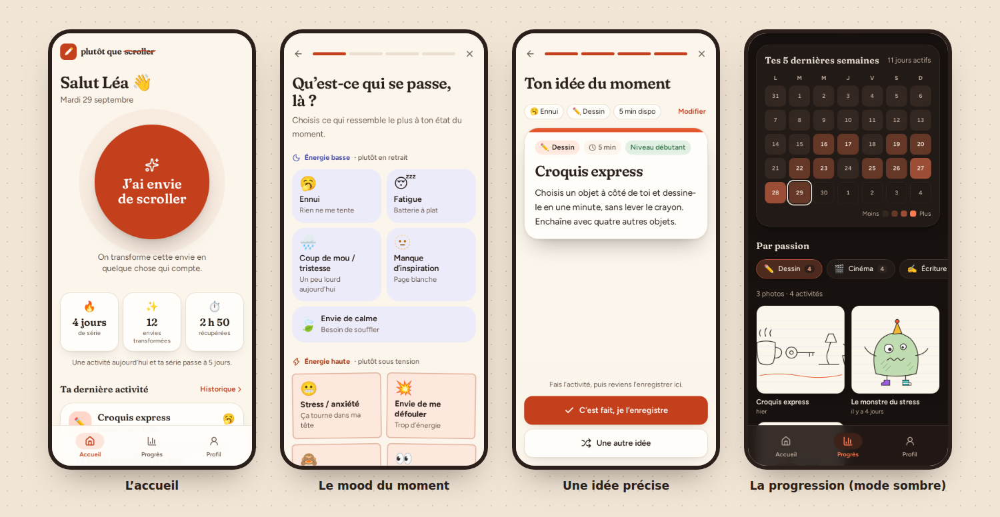

# Plutôt Que Scroller — prototype web

Transformer chaque envie de scroller en un petit moment créatif lié à une passion, et rendre la progression visible pour que ce soit elle qui donne envie de continuer (plutôt que la contrainte).

Ce dépôt contient le prototype web de l'application : une vraie application React qui tourne entièrement dans le navigateur, avec une vraie logique métier et des données sauvegardées localement (IndexedDB). Elle est pensée comme une app mobile et pourra devenir une Telegram Mini App sans tout réécrire (voir [Vers une Telegram Mini App](#vers-une-telegram-mini-app)).



---

## Lancer le projet

Prérequis : [Node.js](https://nodejs.org) **20.19 ou plus récent** (la version LTS actuelle convient), avec npm.

```bash
npm install
npm run dev
```

Ouvre ensuite l'adresse affichée dans le terminal (en général http://localhost:5173).

- **Voir l'app « comme sur un téléphone »** : sur ordinateur, l'app s'affiche dans une colonne centrée. Tu peux aussi ouvrir les outils de développement (F12) et activer le mode appareil mobile.
- **La tester sur ton vrai téléphone** (même réseau Wi-Fi) : `npm run dev -- --host`, puis ouvre sur le téléphone l'adresse « Network » affichée. Tu peux ensuite l'**ajouter à l'écran d'accueil** (menu Partager → « Sur l'écran d'accueil » sur iPhone, menu ⋮ → « Ajouter à l'écran d'accueil » sur Android) : elle s'ouvre alors en plein écran, avec sa propre icône, comme une vraie app. Les données enregistrées sont propres à chaque navigateur et à chaque adresse : celles de ton ordinateur ne sont pas copiées sur ton téléphone.

| Commande | Rôle |
| --- | --- |
| `npm run dev` | Lance l'app en développement (rechargement automatique à chaque modification) |
| `npm test` | Lance les tests automatiques (bibliothèque, moteur, statistiques, base de données) |
| `npm run typecheck` | Vérifie les types TypeScript |
| `npm run build` | Construit la version finale dans `dist/` |
| `npm run preview` | Sert la version construite, pour la tester |

Sur GitHub, ces vérifications (tests + build) se lancent **automatiquement** à chaque pull request et à chaque mise à jour de `main` (fichier `.github/workflows/ci.yml`) : si une modification de la bibliothèque d'activités casse quelque chose, GitHub l'indique par une croix rouge.

---

## Ce que fait le prototype

1. **Onboarding** (première visite) : prénom (facultatif), puis choix des passions dans un catalogue organisé en 8 familles. Si aucune passion n'est cochée, le bouton « Je ne sais pas trop » ouvre un chemin alternatif : *« Qu'est-ce qui te plaît dans la vie ? »* (8 réponses), qui redirige vers les familles correspondantes avec des passions faciles pré-cochées et le **mode débutant** activé.
2. **Accueil** : le gros bouton « J'ai envie de scroller », la série (streak), le nombre d'envies transformées, le temps récupéré et la dernière activité.
3. **Parcours** : mood (9 moods en deux familles d'énergie, affichées différemment) → passion du moment (parmi celles du profil) → temps disponible (5 / 15 / 30 min) → une activité précise. « Une autre idée » relance le tirage sans refaire les étapes ; « C'est fait, je l'enregistre » l'ajoute à l'historique. On peut ensuite ajouter une photo (dessin), un film et sa note (cinéma) ou une petite note.
   *Si le profil ne compte qu'une passion, l'étape « passion » est sautée.*
4. **Progrès (tableau de bord)** : statistiques, calendrier des 5 dernières semaines, et une vue par passion — **galerie de photos** pour le dessin, **films notés sur 5** pour le cinéma, **frise chronologique** pour les autres. Lien vers l'**historique complet**, filtrable par passion et par humeur (avec modification de la note et suppression).
5. **Profil** : prénom, passions, mode débutant, thème (auto / clair / sombre), données de démo, et **réinitialisation** avec une fenêtre de confirmation maison.

Au premier lancement, une douzaine d'**activités de démonstration** sont ajoutées pour que le tableau de bord ne soit pas vide (série de 4 jours, 3 dessins en galerie, 4 films notés…). Elles portent l'étiquette « démo » dans l'historique et se retirent (ou se remettent) depuis le profil.

---

## La bibliothèque d'activités : où elle est, comment l'enrichir

Elle se trouve dans **`src/data/activities/`**, un fichier par famille de passions :

| Fichier | Passions |
| --- | --- |
| `artsVisuels.ts` | dessin, peinture, photographie, illustration numérique, mode / stylisme |
| `audiovisuel.ts` | cinéma, animation, montage vidéo |
| `mots.ts` | écriture (fiction), poésie, journal intime, critique / blogging |
| `son.ts` | musique (instrument), chant, composition, podcast / audio |
| `corps.ts` | danse, sport, théâtre, arts martiaux |
| `fabrication.ts` | bricolage / DIY, cuisine, couture, jardinage |
| `esprit.ts` | jeux vidéo créatifs, programmation créative, jeux de société, échecs |
| `nature.ts` | randonnée, observation de la nature, voyage / découverte de lieux |

Elle contient aujourd'hui **747 activités** : 5 par mood pour le dessin, le cinéma, l'animation, l'écriture, la musique, le sport et la cuisine (couvrant 5, 15 et 30 min), et 2 par mood pour toutes les autres passions.

### Ajouter une activité

Dans le fichier de la famille, repère la passion, puis le mood, et ajoute une ligne sur le modèle des autres :

```ts
export const dessin = definePassionActivities('dessin', {
  ennui: [
    { duration: 5, level: 'debutant', title: 'Croquis express', description: 'Choisis un objet à côté de toi et dessine-le en une minute, sans lever le crayon.' },
    // ↓ ta nouvelle activité
    { duration: 15, title: 'Mon titre', description: 'Une ou deux phrases concrètes : quoi faire, exactement.' },
  ],
  // …
})
```

| Champ | Obligatoire | Valeurs |
| --- | --- | --- |
| `duration` | oui | `5`, `15` ou `30` (minutes) |
| `title` | oui | titre court, affiché en gros sur la carte |
| `description` | oui | une consigne concrète et actionnable |
| `level` | non | `'debutant'` (accessible sans expérience) ou `'intermediaire'` (écartée en mode débutant). Sans niveau = convient à tous |

Les moods sont rangés sous ces clés : `ennui`, `fatigue`, `'coup-de-mou'`, `'manque-inspiration'`, `calme` (énergie basse) et `stress`, `defouler`, `procrastination`, `curiosite` (énergie haute).

Quelques conseils :

- Écris des consignes qu'on peut suivre tout de suite, sans lien à ouvrir obligatoirement ni matériel rare. Évite le générique (« dessine quelque chose »).
- Utilise l'apostrophe typographique `’` dans le texte (sinon, entoure le texte de guillemets doubles `"…"`). Tu peux mettre des espaces normales avant `?`, `!` et `:` : l'app les rend insécables à l'affichage.
- L'identifiant d'une activité est calculé à partir de la passion, du mood et du titre. Changer un titre ne casse rien (l'historique garde une copie du texte).
- Lance **`npm test`** après tes modifications : les tests vérifient qu'il n'y a pas de doublon et que chaque passion garde assez d'activités par mood.

### Ajouter une passion

1. Ajoute son identifiant au type `PassionId` dans `src/types/index.ts`.
2. Ajoute-la dans `src/data/passions.ts` (dans `PASSIONS` et dans la liste de sa famille). Le champ `progressView` choisit sa vue dans le tableau de bord : `'gallery'`, `'films'` ou `'timeline'`.
3. Écris ses activités dans le fichier de sa famille et référence-la dans `src/data/activities/index.ts`.

TypeScript (`npm run typecheck`) signale tout oubli.

---

## Comment le moteur choisit une activité

Le code est dans **`src/services/activityEngine.ts`** (commenté pas à pas, et testé dans `activityEngine.test.ts`).

1. Il ne pioche **que dans la passion choisie**.
2. Il cherche d'abord la combinaison **exacte** passion + mood + durée.
3. Si elle n'existe pas, ou si tout a déjà été vu avec « une autre idée », il élargit par paliers, en restant toujours dans le temps disponible : même mood mais plus court → mood de la même famille d'énergie → n'importe quel mood. Un petit message explique pourquoi quand ce n'est pas une correspondance exacte.
4. Dans un palier, il tire au sort en **évitant les 15 dernières activités réalisées**, pour garder de la variété.
5. En **mode débutant**, les activités « intermédiaire » sont écartées.
6. Quand toutes les idées ont été vues, il recommence un tour.

---

## Données et persistance

- Tout est enregistré **dans le navigateur**, dans une base IndexedDB nommée `plutot-que-scroller` (via la bibliothèque [Dexie](https://dexie.org)). Les données survivent aux rechargements et aux redémarrages, et ne quittent jamais l'appareil.
- Le schéma est décrit dans **`src/db/database.ts`** : tables `profile`, `history` (une ligne par envie transformée), `photos` (images de la galerie, réduites à 1400 px) et `meta`.
- Seuls `src/db/` et `src/services/` touchent à la base. Les écrans lisent les données via les hooks de `src/hooks/useData.ts`, qui se mettent à jour tout seuls quand la base change.
- Les statistiques ne sont pas stockées : elles sont recalculées à partir de l'historique (`src/services/stats.ts`).
  - **Série** : jours consécutifs avec au moins une envie transformée. Tant que la journée n'est pas finie, la série d'hier reste « en jeu ».
  - **Temps récupéré** : la somme des durées des activités réalisées. Pour changer la formule, modifie `minutesReclaimedFor` dans `stats.ts`.
- Les données de démo sont définies dans `src/services/demoData.ts`.
- Pour voir la base : outils de développement (F12) → onglet *Application* (Chrome) ou *Stockage* (Firefox) → *IndexedDB* → `plutot-que-scroller`.
- Seule la préférence de thème est gardée dans le `localStorage` (pour éviter un flash blanc au chargement en mode sombre).

---

## Organisation du code

```
src/
├── types/index.ts          Modèle de données : Passion, Mood, Activity, UserProfile, HistoryEntry…
├── data/                   Contenus (pas de logique)
│   ├── passions.ts         Catalogue des passions par famille
│   ├── moods.ts            Les 9 moods et leurs deux familles d'énergie
│   ├── lifeInterests.ts    Chemin « Qu'est-ce qui te plaît dans la vie ? »
│   ├── activities/         ← LA BIBLIOTHÈQUE D'ACTIVITÉS
│   └── demoSketches.ts     Dessins SVG des données de démo
├── db/database.ts          Schéma de la base locale (Dexie / IndexedDB)
├── services/               Logique métier, indépendante de l'interface
│   ├── activityEngine.ts   Moteur de sélection d'activité
│   ├── stats.ts            Série, temps récupéré, calendrier…
│   ├── historyService.ts   Enregistrer, modifier, supprimer une activité, photos
│   ├── profileService.ts   Profil
│   ├── demoData.ts         Données de démo et réinitialisation
│   ├── preferences.ts      Thème clair / sombre
│   └── appInit.ts          Démarrage de l'app
├── hooks/                  Données « en direct », routage, thème
├── platform/index.ts       Adaptateur navigateur / Telegram
├── components/             Composants d'interface (ui, layout, onboarding, trigger, dashboard)
│   └── ErrorBoundary.tsx   Écran de secours en cas d'erreur inattendue
├── screens/                Les écrans : accueil, progrès, historique, profil
├── styles/index.css        Identité visuelle : couleurs, typographies, animations
├── App.tsx                 Choix de l'écran à afficher
└── main.tsx                Point d'entrée
```

**Technos** : React 19, TypeScript (mode strict), Vite, Tailwind CSS 4, Dexie (IndexedDB), Vitest pour les tests, icônes Lucide, polices Fraunces et Figtree (embarquées, l'app fonctionne hors ligne).

---

## Vers une Telegram Mini App

L'architecture prépare la migration :

- **Adaptateur de plateforme** (`src/platform/index.ts`) : tout ce qui dépend de l'hôte (prénom de l'utilisateur, vibrations, démarrage) passe par lui. Une version Telegram minimale y est déjà écrite : il suffira d'ajouter le script `https://telegram.org/js/telegram-web-app.js` dans `index.html` pour qu'elle s'active quand l'app est ouverte depuis Telegram (le prénom du compte pré-remplira l'onboarding). Il restera à y brancher le bouton retour natif et les couleurs du thème Telegram.
- **Navigation par hash** (`#/progres`, `#/profil`…) : fonctionne dans la webview Telegram sans configuration serveur. Le bot pourra ouvrir directement le parcours via un bouton qui pointe vers `#/envie`.
- **Persistance isolée** dans `src/db/` et `src/services/` : pour synchroniser entre appareils (Telegram CloudStorage ou un petit backend), c'est cette couche qu'on remplacera, sans toucher aux écrans.
- **Moteur et statistiques sans dépendance à React** : réutilisables tels quels côté bot ou serveur.
- **Build statique relatif** (`base: './'`) : le dossier `dist/` peut être hébergé n'importe où et déclaré comme Mini App auprès de BotFather.

---

## Design

- Identité « carnet de création » : papier crème, encre brun foncé, accent tomate brûlée, titres en Fraunces (sérif doux), texte en Figtree.
- Mode clair et mode sombre (automatique selon le système, ou forcé dans le profil).
- Les couleurs sont des variables dans `src/styles/index.css` : modifier une couleur à cet endroit la change partout, en clair comme en sombre.
- Animations légères entre les étapes, désactivées si le système demande de réduire les animations.
- Accessibilité : navigation au clavier, fenêtres modales qui gardent le focus, libellés pour les lecteurs d'écran, contrastes suffisants. Les 19 écrans ont été audités en clair et en sombre avec [axe-core](https://github.com/dequelabs/axe-core) (règles WCAG 2.1 AA) : aucun problème relevé.
- Robustesse : si un écran plante, un message propose de revenir à l'accueil (les données restent intactes) ; une note saisie après une activité est enregistrée même si l'on quitte l'écran sans appuyer sur « Terminer » ; la série se met à jour au passage de minuit, même si l'app est restée ouverte.

---

## Pub de 15 secondes

Le dossier [`promo/`](promo/) contient une pub verticale de 15 s en motion design (format Reels / TikTok / Shorts), entièrement générée par du code : animation, musique et bruitages. Elle reprend l'identité de l'app et six vraies activités de la bibliothèque. Son [README](promo/README.md) explique comment la refaire ou la modifier.

---

## Limites connues du prototype

- Les données restent **sur un seul appareil et un seul navigateur**. Vider les données du site efface tout (il n'y a pas encore d'export ni de synchronisation).
- Un seul profil par navigateur.
- Pas de « mode travail » ni de blocage des réseaux sociaux (hors périmètre de cette V1).
- Les liens mentionnés dans certaines activités (Lichess, Chrome Music Lab…) ne sont pas cliquables : ce sont des consignes à suivre.
